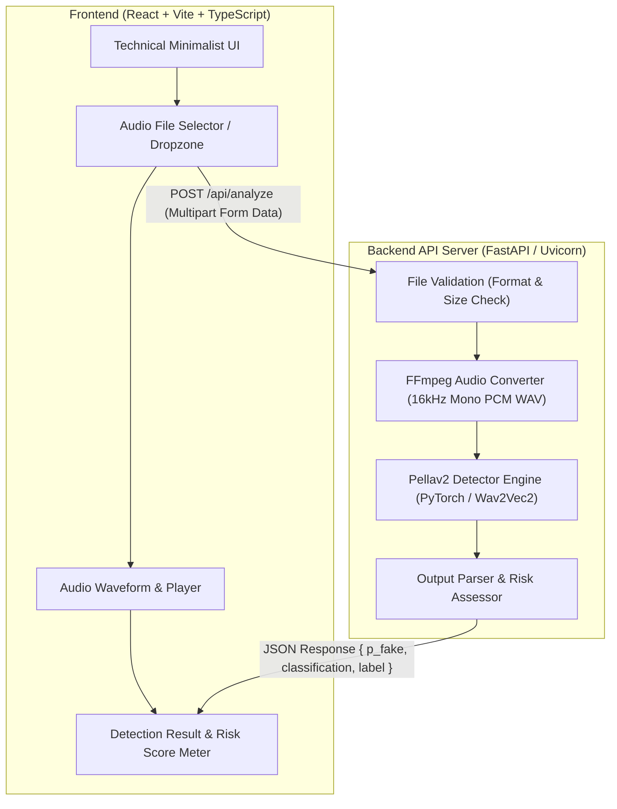

# VoiceGuard — Voice Cloning Attack Detection

[](LICENSE)
[](https://fastapi.tiangolo.com/)
[](https://react.dev/)
[](https://pytorch.org/)
[](https://tailwindcss.com/)

An enterprise-grade, high-precision detection system engineered to identify synthetic and AI-generated voice recordings to mitigate voice cloning impersonation threats.

---

## 📋 Table of Contents

- [Overview & Threat Model](#-overview--threat-model)
- [System Architecture](#-system-architecture)
- [Technical Stack & Environment](#-technical-stack--environment)
  - [Backend Dependencies](#backend-dependencies)
  - [Frontend Dependencies](#frontend-dependencies)
- [Project Directory Structure](#-project-directory-structure)
- [Installation & Setup Guide](#-installation--setup-guide)
  - [Prerequisites](#1-prerequisites)
  - [1. Backend Setup & Server Execution](#2-backend-setup--server-execution)
  - [2. Frontend Setup & Server Execution](#3-frontend-setup--server-execution)
- [API Reference](#-api-reference)
- [Design System & Aesthetics](#-design-system--aesthetics)
- [Detection Philosophy & Terminology](#-detection-philosophy--terminology)
- [License](#-license)

---

## 🎙️ Overview & Threat Model

Attackers increasingly use **AI voice cloning technology** to impersonate trusted authority figures—such as CEOs, CFOs, IT administrators, or family members. By generating realistic voice clips, malicious actors create false urgency to authorize fraudulent wire transfers, extract sensitive credentials, or bypass security protocols.

**VoiceGuard** allows security teams and analysts to upload suspicious audio files (`MP3`, `WAV`, `OGG`, `FLAC`) and evaluate acoustic artifacts indicative of synthetic generation using deep neural network inference.

---

## 🏗️ System Architecture

The application operates on a decoupled client-server model. The frontend provides a **Technical Minimalist** control panel, while the backend orchestrates FFmpeg normalization and executes PyTorch neural network inference via the **Pellav2** model engine.



### Data Lifecycle

1. **Upload & Validation**: User submits an audio clip (`.wav`, `.mp3`, etc., up to 50MB) via the drag-and-drop zone.
2. **Audio Preprocessing**: FastAPI receives the upload and invokes `ffmpeg.exe` to convert the audio into a standard **16 kHz mono 16-bit PCM WAV** stream.
3. **Pellav2 Model Inference**: The preprocessed clip is passed to `pellav2_infer.py`. The model leverages a **Wav2Vec2** XLS-R-300M backbone with hidden-state feature fusion and a linear classification head (`pellav2_detector.pt`).
4. **Probabilistic Risk Scoring**: The model calculates $p_{\text{fake}} \in [0.0, 1.0]$. The backend returns a structured JSON payload to render real-time probabilistic scores and safety recommendations on the dashboard.

---

## ⚡ Technical Stack & Environment

### Backend Dependencies
The backend requires **Python 3.10+** and relies on the following core libraries (located at `backend/requirements.txt`):

| Environment Component | Version / Spec | Purpose |
| :--- | :--- | :--- |
| **Python** | `3.10+` | Runtime environment |
| **FastAPI** | `^0.110.0` | Asynchronous REST API framework |
| **Uvicorn** | `^0.28.0` | ASGI web server implementation |
| **PyTorch** (`torch`) | `^2.0.0` | Tensor computation & ML model inference |
| **Transformers** | `^4.38.0` | Pre-trained Wav2Vec2 architecture weights |
| **SoundFile** | `^0.12.1` | Audio reading and buffer processing |
| **NumPy** | `^1.26.0` | Numerical array operations for audio signals |
| **FFmpeg** | `ffmpeg.exe` (Root) | Audio sampling rate normalization (16kHz Mono) |

### Frontend Dependencies
The frontend is built with modern Web standards (located at `frontend/package.json`):

| Technology | Specification | Purpose |
| :--- | :--- | :--- |
| **Framework** | React 18 + TypeScript | UI component structure & strict type safety |
| **Build Tool** | Vite 8+ | Lightning-fast HMR and production bundle optimizer |
| **Styling** | Tailwind CSS v4 | Utility-first styling & custom design tokens |
| **Typography** | Space Grotesk, JetBrains Mono, General Sans | High-contrast technical blueprint aesthetic |

---

## 📁 Project Directory Structure

```text
voice-detector/
├── backend/
│   ├── main.py              # FastAPI application server & routes (/api/health, /api/analyze)
│   └── requirements.txt     # Python backend dependencies
├── frontend/
│   ├── src/
│   │   ├── components/      # Modular React UI components
│   │   │   ├── Navbar.tsx
│   │   │   ├── Hero.tsx
│   │   │   ├── UploadZone.tsx
│   │   │   ├── AudioPreview.tsx
│   │   │   ├── AnalysisLoader.tsx
│   │   │   ├── DetectionResult.tsx
│   │   │   ├── ProbabilityMeter.tsx
│   │   │   ├── SafetyRecommendation.tsx
│   │   │   ├── HowItWorks.tsx
│   │   │   ├── NetworkTopology.tsx
│   │   │   ├── SystemBento.tsx
│   │   │   └── Footer.tsx
│   │   ├── services/
│   │   │   └── api.ts       # Centralized API service & fetch handlers
│   │   ├── types/
│   │   │   └── index.ts     # TypeScript interfaces & API response contracts
│   │   ├── App.tsx          # Main state manager
│   │   ├── main.tsx         # React entrypoint
│   │   └── index.css        # CSS variable tokens & global baseline
│   ├── .env                 # Frontend environment variables (VITE_API_URL)
│   ├── package.json         # Node.js dependencies & scripts
│   └── vite.config.ts       # Vite bundler configuration
├── convert_and_test.py      # Standalone CLI test script
├── ffmpeg.exe               # Native FFmpeg binary for audio normalization
├── pellav2_detector.pt      # Pre-trained Pellav2 model weights binary
├── pellav2_infer.py         # PyTorch inference routine
└── README.md                # Project documentation
```

---

## 🚀 Installation & Setup Guide

Follow these step-by-step instructions to set up and run both backend and frontend environments locally.

### 1. Prerequisites
Ensure you have the following installed on your machine:
- **Python 3.10+** (`python --version`)
- **Node.js 18+** (`node --version`) and **npm** (`npm --version`)
- **Git**

---

### 2. Backend Setup & Server Execution

1. **Navigate to the root directory**:
   ```bash
   cd voice-detector
   ```

2. **Create and activate a virtual environment**:
   - **On Windows (PowerShell)**:
     ```powershell
     python -m venv venv
     .\venv\Scripts\Activate.ps1
     ```
   - **On macOS / Linux**:
     ```bash
     python3 -m venv venv
     source venv/bin/activate
     ```

3. **Install Backend Dependencies**:
   ```bash
   pip install -r backend/requirements.txt
   ```

4. **Start the FastAPI Backend Server**:
   ```bash
   cd backend
   python -m uvicorn main:app --reload --port 8000
   ```
   > The API server will start on **`http://127.0.0.1:8000`**.  
   > OpenAPI interactive documentation is available at `http://127.0.0.1:8000/docs`.

---

### 3. Frontend Setup & Server Execution

1. **Open a new terminal tab/window** and navigate to the `frontend` folder:
   ```bash
   cd voice-detector/frontend
   ```

2. **Install Node dependencies**:
   ```bash
   npm install
   ```

3. **Configure Environment Variables**:
   Verify `.env` exists in `frontend/.env`:
   ```env
   VITE_API_URL=http://127.0.0.1:8000
   ```

4. **Run the Vite Development Server**:
   ```bash
   npm run dev
   ```
   > Open your browser and navigate to **`http://localhost:5173`**.

5. **Build for Production** *(Optional)*:
   ```bash
   npm run build
   ```

---

## 🔌 API Reference

### Health Check
- **URL**: `/api/health`
- **Method**: `GET`
- **Response**:
  ```json
  {
    "status": "operational",
    "model": "pellav2",
    "ffmpeg": true,
    "model_file": true
  }
  ```

### Analyze Audio Clip
- **URL**: `/api/analyze`
- **Method**: `POST`
- **Content-Type**: `multipart/form-data`
- **Parameters**: `file` (Binary audio data - `.mp3`, `.wav`, `.ogg`, `.flac`)
- **Response Example**:
  ```json
  {
    "filename": "executive_call.mp3",
    "p_fake": 0.9842,
    "classification": "likely_ai_generated",
    "label": "Likely AI-Generated"
  }
  ```

---

## 🎨 Design System & Aesthetics

VoiceGuard adheres to a **Technical Minimalist** design language inspired by structural architectural blueprints and high-precision laboratory instruments:

- **Color Palette**:
  - `Paper` (`#F7F7F5`) — Background substrate
  - `Forest` (`#1A3C2B`) — Primary brand element
  - `Grid` (`#3A3A38`) — Hairline boundaries and text
  - `Coral` (`#FF8C69`) — High-risk warning accent
  - `Mint` (`#9EFFBF`) — Low-risk operational accent
  - `Gold` (`#F4D35E`) — Metadata & status tag accent
- **Borders & Radii**: Hairline 1px borders (`rgba(58,58,56,0.20)`), 0px to 2px sharp corners, zero box shadows, zero gradients, zero glassmorphism.
- **Background**: Subtle SVG mosaic grid pattern providing continuous structural depth without distracting readability.

---

## ⚖️ Detection Philosophy & Terminology

Voice cloning detection is intrinsically **probabilistic**. VoiceGuard adheres strictly to accurate security reporting standards:

- ✅ **Approved Terminology**:
  - *"Likely Real"* ($p_{\text{fake}} < 0.5$)
  - *"Likely AI-Generated"* ($p_{\text{fake}} \ge 0.5$)
  - *"AI-generated probability"*
  - *"Detection score"*
- ❌ **Prohibited Claims**:
  - *"100% Real"* / *"100% Fake"*
  - *"Proof of AI"*
  - *"Guaranteed detection"*

> **Notice**: Detection scores should be evaluated as one parameter within a multi-factor verification policy. Always independently verify sensitive instructions through an out-of-band communication channel.

---

## 📄 License

This project is released under the [MIT License](LICENSE).
