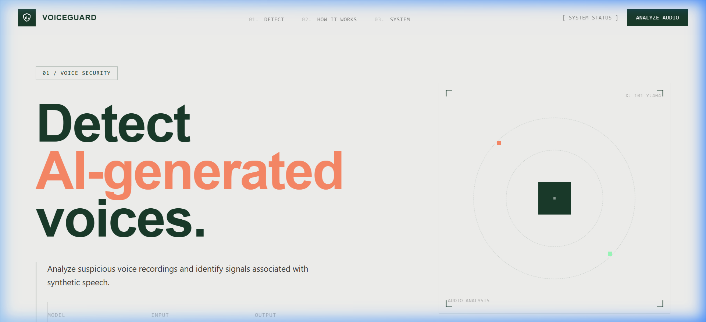
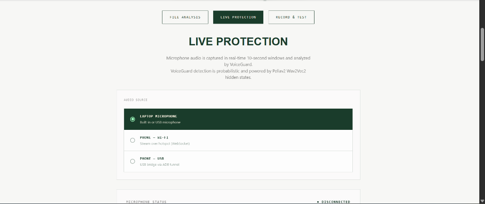
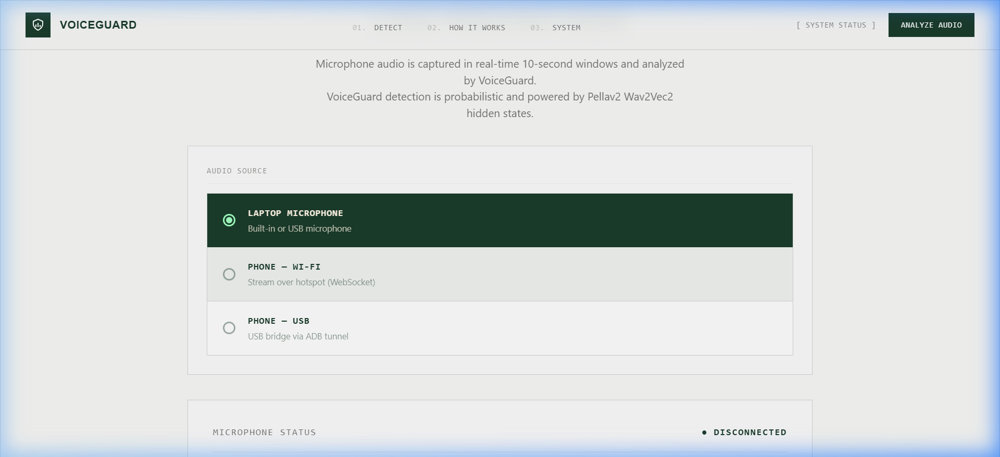
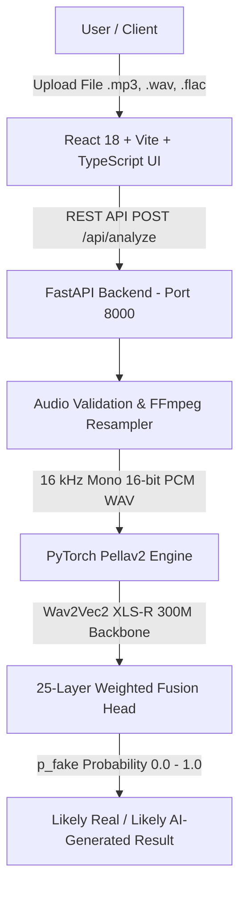
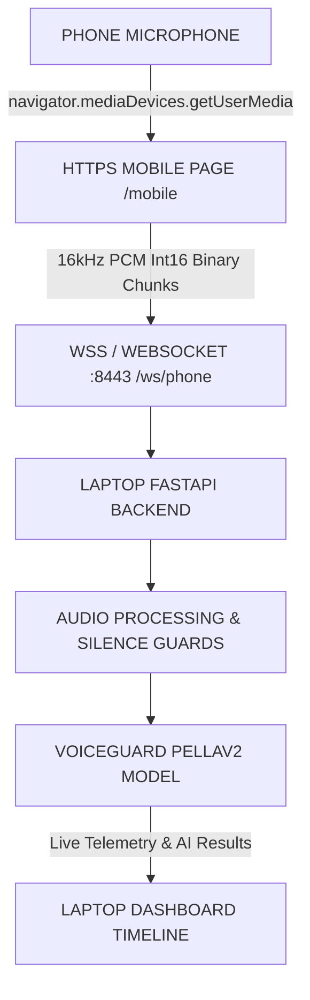

# VoiceGuard — Voice Cloning Attack Detection

[](https://fastapi.tiangolo.com/)
[](https://react.dev/)
[](https://pytorch.org/)
[](https://sih.gov.in)
[](LICENSE)

An enterprise-grade AI cybersecurity platform engineered to detect synthetic speech, deepfake audio, and voice cloning impersonation attacks in real-time. Built for **Smart India Hackathon (SIH) 2026**.

---

## 📌 Project Overview

| Attribute | Details |
| :--- | :--- |
| **Project Name** | VoiceGuard — AI-Powered Voice Impersonation Analysis |
| **Hackathon** | Smart India Hackathon (SIH) 2026 |
| **Problem Statement ID** | **26104** |
| **Problem Statement** | AI-Powered Real-Time Detection and Prevention of Voice Cloning Impersonation Attacks |
| **Theme** | Blockchain & Cybersecurity |
| **Team** | Voice Guard |

VoiceGuard provides a high-confidence defense mechanism against voice spoofing and social engineering financial fraud. It combines a state-of-the-art **Pellav2 Wav2Vec2 XLS-R 300M** deep neural network with a real-time, micro-latency phone-to-laptop microphone streaming system operating over local HTTPS/WSS connections.

---

## 📸 Interface & Screenshots

### Desktop Dashboard
The main VoiceGuard dashboard provides batch file upload analysis, deepfake probability scoring, and real-time audio visualization.



### Mobile Live Audio Interface
The mobile live audio streaming page captures raw **16 kHz 16-bit PCM** microphone audio directly on Android/iOS mobile web browsers over secure HTTPS/WSS, transmitting real-time stream telemetry (Frames, Bytes, Audio Level, Duration) back to the laptop dashboard.



*Caption: The VoiceGuard phone-to-laptop live streaming interface displays live connection status, secure microphone origin status, audio stream telemetry counters (Frames Sent, Bytes Sent), live RMS audio meter, and audio control toggles.*

### Live Protection Dashboard
Allows switching audio input sources between Laptop Built-in Microphone, Phone Wi-Fi Stream, and Phone USB Bridge with real-time 10-second window AI analysis.



---

## 🏗️ System Architecture



### Real-Time Phone Audio Architecture



---

## 🔍 Audio Detection Pipeline

1. **Audio Ingestion**: Audio files (`.mp3`, `.wav`, `.flac`, `.ogg`, `.m4a`, `.aac`, `.webm`) or live mobile microphone binary PCM frames are ingested by the FastAPI backend.
2. **FFmpeg Resampling & Bandpass Filtering**: Input audio is normalized to **16 kHz mono 16-bit PCM WAV** and passed through an **80 Hz - 7.5 kHz voice bandpass filter** to strip low-frequency hums and ultrasonic noise.
3. **Silence & Quality Guarding**: Audio is segmented into **4-second non-overlapping windows**. Windows with low RMS energy ($< 0.003$) or high silence ratio ($> 60\%$) are rejected before model execution.
4. **Pellav2 Feature Extraction**: Each valid 4-second segment is passed through the **Wav2Vec2 XLS-R 300M** backbone. Hidden representations across all 25 transformer layers are dynamically weighted via a learned softmax layer fusion mechanism.
5. **Aggregation & Scoring**: Individual window predictions are aggregated into a composite synthetic probability ($p_{\text{fake}} \in [0.0, 1.0]$) and mapped to threat classifications (`Likely Real`, `Suspicious`, `Likely AI-Generated`).

---

## 🤖 Pellav2 Model Details

- **Model Architecture**: `Pellav2` (Wav2Vec2 XLS-R 300M backbone + multi-layer fusion classifier head).
- **Backbone Model**: `facebook/wav2vec2-xls-r-300m` (dynamically initialized via Hugging Face `transformers`).
- **Tuned Weights File**: `pellav2_detector.pt` (~1.26 GB).
- **Model Storage & Path**: Located at root directory `c:\Users\HP\Downloads\voice-detector\pellav2_detector.pt` or configured via `MODEL_PATH` environment variable.
- **Input Format**: 16,000 Hz, 1-channel mono float32 audio array normalized to zero mean and unit variance per 4-second chunk (64,000 samples).
- **Output**: Sigmoid logit scalar $p_{\text{fake}} \in [0.0, 1.0]$. A score $\ge 0.50$ indicates synthetic speech.

---

## 🛠️ Technology Stack

- **Backend**: Python 3.10+, FastAPI, Uvicorn, PyTorch, Hugging Face `transformers`, `soundfile`, `numpy`, `websockets`, `qrcode`, `cryptography`.
- **Audio Converter**: FFmpeg (Resampling, highpass/lowpass filtering).
- **Frontend**: React 18, TypeScript, Vite, Web Audio API (`AudioContext`, `ScriptProcessorNode`), TailwindCSS, Lucide Icons, QR Code Canvas.
- **Security & SSL**: Local SSL certificate generator (`generate_cert.py` / `cryptography`) with SAN support for local LAN IP addresses.

---

## 📁 Project Structure

```text
voice-detector/
├── backend/
│   ├── main.py              # FastAPI server, REST routes, WebSockets, PCM buffer
│   ├── audio_pipeline.py    # Shared FFmpeg preprocessing, silence guards, Pellav2 infer
│   ├── run_https.py         # Dual HTTP (:8000) & HTTPS (:8443) Uvicorn launcher
│   ├── generate_cert.py     # Local SSL cert auto-generator with LAN IP SAN
│   ├── mobile.html          # Lightweight HTTPS mobile web page for phone mic streaming
│   ├── requirements.txt     # Backend Python dependencies
│   ├── cert.pem             # Local SSL Certificate
│   └── key.pem              # Local SSL Private Key
├── frontend/
│   ├── src/
│   │   ├── components/      # FileAnalysis, LiveProtection, PhoneConnectModal, RecordTest
│   │   ├── services/api.ts  # Dynamic API URL resolution (HTTP/HTTPS detection)
│   │   └── types.ts         # TypeScript definitions
│   ├── package.json
│   └── vite.config.ts
├── docs/
│   └── screenshots/         # Verified local UI screenshots
├── pellav2_infer.py         # Standalone CLI inference script
├── pellav2_detector.pt      # PyTorch model weights (~1.26 GB)
├── render.yaml              # Render deployment blueprint
└── README.md
```

---

## 📋 Requirements & Prerequisites

1. **Python 3.10+**
2. **Node.js 18+** & `npm`
3. **FFmpeg** installed and accessible in system `PATH`
4. **PyTorch & CUDA/CPU**: PyTorch 2.0+

---

## ⚙️ Environment Variables

Configure backend and frontend environment variables via `.env` files or system environment.

### Backend Environment Variables (`backend/.env`)

| Variable | Default Value | Description |
| :--- | :--- | :--- |
| `FRONTEND_URL` | `http://localhost:5173` | Allowed CORS origin for local web client |
| `MODEL_PATH` | `../pellav2_detector.pt` | Path to PyTorch model weights (`pellav2_detector.pt`) |
| `FFMPEG_PATH` | `ffmpeg` | Executable path for FFmpeg |
| `MAX_UPLOAD_SIZE_MB` | `50` | Maximum file upload size limit in MB |
| `PORT` | `8000` | HTTP API port for local laptop frontend |
| `HTTPS_PORT` | `8443` | HTTPS/WSS port for mobile phone streaming |

### Frontend Environment Variables (`frontend/.env`)

| Variable | Default Value | Description |
| :--- | :--- | :--- |
| `VITE_API_URL` | `http://127.0.0.1:8000` | Base API URL consumed by Vite client |

---

## 🔌 FFmpeg Setup

FFmpeg is strictly required for converting multi-format audio files (`.mp3`, `.m4a`, `.flac`, `.webm`) into 16kHz s16 WAV files and applying bandpass filters.

### Installation

#### Windows
```powershell
winget install FFmpeg.FFmpeg
```

#### Linux (Ubuntu/Debian)
```bash
sudo apt update && sudo apt install -y ffmpeg
```

#### macOS
```bash
brew install ffmpeg
```

#### Verification
```bash
ffmpeg -version
```

---

## 🚀 Quick Start Guide

### 1. Clone Repository
```bash
git clone https://github.com/jaggu-max/voice-cloning-attack-detection.git
cd voice-cloning-attack-detection
```

### 2. Backend Setup
```bash
cd backend
python -m venv venv

# Windows PowerShell:
..\venv\Scripts\activate

# Linux/macOS:
source venv/bin/activate

pip install -r requirements.txt
```

### 3. Start Backend Dual Server
Run the dual server script to launch HTTP on port `8000` and HTTPS on port `8443`:
```bash
python run_https.py
```

### 4. Frontend Setup
Open a new terminal window:
```bash
cd frontend
npm install
npm run dev
```
Open **[http://localhost:5173](http://localhost:5173)** in your browser.

---

## 📱 Phone-to-Laptop Live Streaming (HTTPS & WSS)

### Root Cause & HTTPS Requirement
Android Chrome blocks `navigator.mediaDevices.getUserMedia()` on insecure HTTP origins (e.g., `http://10.83.191.174:8000/mobile`), displaying the error: `Microphone requires a secure HTTPS connection`.

VoiceGuard solves this by auto-generating local SSL/TLS certificates and running a dedicated HTTPS/WSS server on port `8443`.

### Step-by-Step Setup

1. **Connect to Same Wi-Fi / Hotspot**: Connect both your laptop and phone to the same Wi-Fi network or Laptop Mobile Hotspot.
2. **Find Laptop LAN IP**:
   ```powershell
   ipconfig
   ```
   *Example LAN IP: `10.83.191.174`*
3. **Open Connect Phone Modal**: On the laptop dashboard (`http://localhost:5173`), navigate to **Live Protection** and click **[ CONNECT PHONE ]**.
4. **Scan QR Code**: Scan the QR code with your phone or open:
   `https://10.83.191.174:8443/mobile`
5. **Accept Self-Signed Certificate**: On Android Chrome, tap **Advanced** → **Proceed to 10.83.191.174 (unsafe)**.
6. **Grant Microphone Permission**: Tap **[ START AUDIO ]** on the phone. Live audio telemetry and real-time detection results will stream back to your laptop interface.

---

## 📡 API Documentation

### REST Endpoints

#### `GET /api/health`
Returns system operational status, model file verification, and FFmpeg availability.
```json
{
  "status": "operational",
  "model": "pellav2",
  "ffmpeg": true,
  "model_file": true
}
```

#### `GET /api/local-ip`
Returns laptop LAN IP address, HTTPS port (`8443`), and generated session token URL.

#### `POST /api/analyze`
Batch analysis of uploaded audio file (`multipart/form-data` with `file`).
```json
{
  "filename": "sample.mp3",
  "p_fake": 0.9984,
  "classification": "likely_ai_generated",
  "label": "AI-Generated Audio",
  "highest_probability": 0.9984,
  "average_probability": 0.9984,
  "duration": 11.2,
  "windows_analyzed": 2,
  "windows_speech": 2,
  "processing_time": 0.42,
  "audio_quality": "good",
  "confidence": 99.8
}
```

#### `POST /api/live/analyze`
Analyzes a 10-second live audio segment (`audio` file + `window_start` + `window_end` form fields) with live WebM/Opus codec calibration applied.

### WebSocket Endpoint

#### `WS /ws/phone?role=phone` or `?role=laptop`
Real-time WebSocket connection for bi-directional binary audio streaming, status heartbeats, live telemetry broadcasting, and detection result updates.

---

## ☁️ Render Cloud Deployment

VoiceGuard is pre-configured for Render deployment via `render.yaml`.

### Render Blueprint Configuration
- **Backend Service**: Python Web Service running Uvicorn (`backend/`).
- **Frontend Site**: React Vite Static Site (`frontend/` output to `dist`).

### Model Storage Strategy on Render
The `pellav2_detector.pt` file is **~1.26 GB** and is excluded from Git tracking via `.gitignore`.
- **Render Persistent Disk**: Attach a disk at `/var/data` and upload `pellav2_detector.pt`. Set `MODEL_PATH=/var/data/pellav2_detector.pt`.
- **External Object Storage**: Store model on AWS S3 or Cloudflare R2 and fetch during build/startup scripts.

---

## 🔧 Troubleshooting Guide

| Issue | Cause | Solution |
| :--- | :--- | :--- |
| `Microphone requires a secure HTTPS connection` | Accessing mobile page over insecure `http://` | Use `https://<LAN_IP>:8443/mobile` as generated by QR code |
| `Network failure or backend unavailable` | Mixed Content or HTTPS cert blocked by browser | Open `http://localhost:5173` on laptop; frontend auto-detects `http://localhost:8000` |
| `Errno 10048: address already in use` | Zombie Uvicorn process holding port 8000/8443 | Run `run_https.py`; it automatically terminates lingering port owners |
| `FFmpeg not found` | FFmpeg missing from system PATH | Install FFmpeg via `winget` / `apt` or place `ffmpeg.exe` in project root |
| `Model file not found` | `pellav2_detector.pt` missing from project root | Place `pellav2_detector.pt` in project directory or set `MODEL_PATH` |
| Mobile page displays `Phone disconnected` | Phone on different Wi-Fi network | Connect phone and laptop to same Wi-Fi network or Laptop Hotspot |

---

## 🔒 Security & Privacy

- **HTTPS/WSS Security**: Encryption for local wireless audio transmission.
- **Local On-Premises Inference**: Audio streams are processed locally in memory; no audio recordings are transmitted to external third-party cloud APIs.
- **Probabilistic Safeguards**: Detection output is a statistical likelihood score ($p_{\text{fake}}$) based on neural feature representations and should be combined with multi-factor verification workflows.

---

## 🚀 Future Scope

- [ ] On-device mobile app (React Native / Android SDK) for direct call interception.
- [ ] Multi-lingual speech feature extraction tuned for regional Indian accents.
- [ ] Enterprise telephony SIP trunking integration for real-time call center protection.

---

## 📜 License

This project is licensed under the MIT License — see the [LICENSE](LICENSE) file for details.
